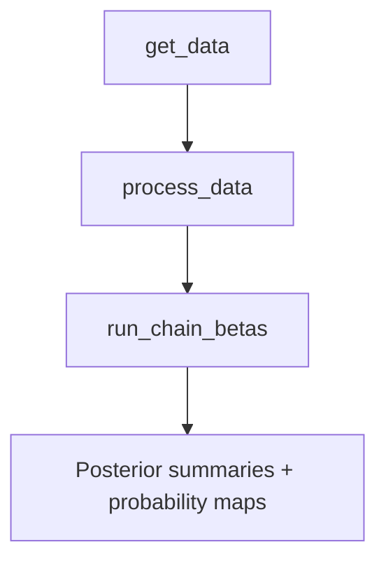

# HiCPotts 

*A Bayesian framework for detection of enriched Hi‑C interactions and experimental biases in Hi-C data*  

[](https://github.com/igosungithub/HiCPotts/actions) &nbsp;
[](LICENSE)

---

## 1  Why HiCPotts?

Hi‑C interaction counts are  

* **sparse** (most bin pairs are zero),  
* **over‑dispersed** and often **zero‑inflated**, and  
* **spatially correlated** along the genome.

**HiCPotts** deals with these challenges by combining

| Layer | Details |
|-------|---------------------------------------|
| **Spatial layer** | **Potts model** (Wu 1982) with interaction parameter \(\gamma\) to capture neighbourhood dependence. |
| **Count layer** | Mixture of three components (“noise”, “signal”, “false‑positive”) modelled with Poisson | NB | ZIP | ZINB. |
| **Bias regression** | Genomic distance, GC content, TE density and chromatin accessibility are covariates in a log‑linear model for the mean. |
| **Inference** | Metropolis‑within‑Gibbs MCMC updates betas, \(\gamma\), zero‑inflation \(\theta\) and dispersion *size* (if NB/ZINB). |

---

## 2  Installation

```r
## released version (once on Bioconductor)
if (!requireNamespace("BiocManager", quietly = TRUE))
    install.packages("BiocManager")
BiocManager::install("HiCPotts")

Requirements: R ≥ 4.2, C++17 compiler, plus
Rcpp, RcppArmadillo, parallel.

library(HiCPotts)

## 1  Load long‑format interaction table
df <- read.csv("hic_interactions.csv")  # start, end, interactions, GC, ACC, TES

## 2  Convert to N×N matrices
prep   <- process_data(df, N = 40, standardization_y = TRUE)
x_vars <- prep$x_vars
y_list <- prep$y                      # list of 40×40 matrices

## 3  Run the three‑component MCMC
res <- run_chain_betas(
  y_sim_list   = y_list,
  N            = 40,
  iterations   = 5000,
  x_vars       = x_vars,
  thetap       = 0.5,        # initial θ
  size_initial = c(1, 1, 1), # initial NB size for the 3 comps
  dist         = "ZINB",
  mc_cores     = 4
)
```




Key exported functions

| Function                                                            | What it does                                                                                                 |
| ------------------------------------------------------------------- | ------------------------------------------------------------------------------------------------------------ |
| `process_data()`                                                    | Converts long‑format counts + covariates to lists of $N \times N$ matrices (counts optionally scaled 1–500). |
| `run_chain_betas()`                                                 | Parallel front‑end to `run_metropolis_MCMC_betas()` for multiple matrices; **always uses three components**. |
| `run_metropolis_MCMC_betas()`                                       | Core Metropolis‑within‑Gibbs sampler.                                                                        |
| `compute_HMRFHiC_probabilities()`                                   | Converts posterior mean betas into per‑pixel probabilities for components 1, 2, 3.                           |
| `prior_combined()`, `likelihood_combined()`, `posterior_combined()` | Compute log‑priors, log‑likelihoods and log‑posteriors.                                                      |
| `pred_combined()`                                                   | Calculates log‑linear predictors $\lambda$.                                                                  |
| `Neighbours_combined()` (C++)                                       | Counts matching neighbours for the Potts model.                                                              |
| `pz_123()` (C++)                                                    | Site‑wise component log‑posterior calculation.                                                               |

```r
mcmc1 <- res[[1]]

## trace of γ
plot(mcmc1$gamma, type = "l", col = "#1f77b4",
     main = "Potts interaction γ", ylab = "γ")

## posterior means of βs for component 1
colMeans(mcmc1$chains[[1]][-(1:2500), ])

pm <- compute_HMRFHiC_probabilities(
  data         = df,
  chain_betas  = mcmc1$chains,
  iterations   = 5000,
  dist         = "ZINB"
)

head(pm[, c("start", "end", "prob1", "prob2", "prob3")])
```
Advanced options
Distribution choice – dist = "Poisson", "NB" or "ZIP".

Fixed vs. data‑driven priors – set use_data_priors = FALSE in the sampler and supply user_fixed_priors.

Proposal tuning – edit the sd_values vectors inside run_metropolis_MCMC_betas().

```r
set.seed(1)
N <- 10
fake <- data.frame(
  start        = rep(1:N, each = N),
  end          = rep(1:N, N),
  interactions = rpois(N*N, 5),
  GC           = runif(N*N),
  ACC          = runif(N*N),
  TES          = runif(N*N)
)

prep   <- process_data(fake, N)
res    <- run_chain_betas(prep$y, N = N, iterations = 100,
                          x_vars = prep$x_vars,
                          thetap = 0.5, size_initial = c(1,1,1),
                          dist   = "Poisson", mc_cores = 1)
```

Another example is using the test_data2.csv file inside the folder; inst/extdata

```r
mydata=read.csv("~/inst/extdata/test_data2.csv")

N=20
thetap=0.6

iterations=2000


# Assuming mydata is a data frame
colnames(mydata)[colnames(mydata) %in% c("start.i.", "start.i", "start")] <- "start"
colnames(mydata)[colnames(mydata) %in% c("end.j.", "end.j", "end")] <- "end"
colnames(mydata)[colnames(mydata) %in% c("Acc", "ACC")] <- "ACC"
colnames(mydata)[colnames(mydata) %in% c("GC", "Gc")] <- "GC"
colnames(mydata)[colnames(mydata) %in% c("Tes", "TEs", "TES")] <- "TES"
colnames(mydata)[colnames(mydata) %in% c("interactions", "interaction")] <- "interactions"


scaled_data<-process_data(mydata, N, scale_max = 500, standardization_y = TRUE)


chains=run_chain_betas(
  N,
  gamma_prior=0.3,
  iterations=iterations,
  x_vars=scaled_data[["x_vars"]],
  y=scaled_data[["y"]],
  use_data_priors=TRUE,
  dist="Poisson",
  distance_metric="manhattan",
  mc_cores = 22
)
```

License
MIT © 2025 Itunu Osuntoki
